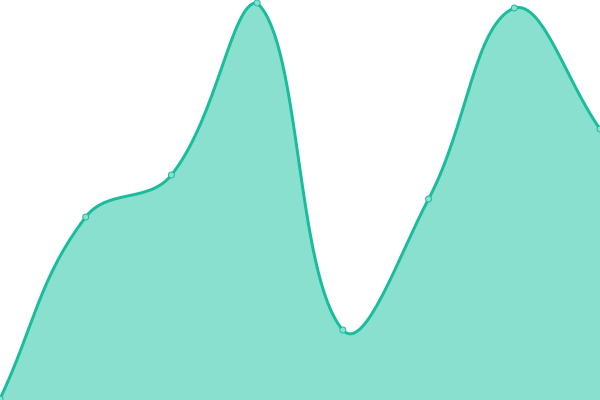
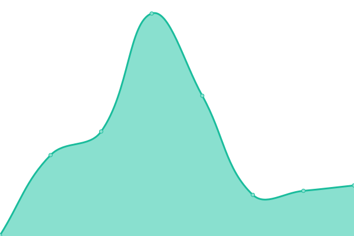

# [📈 Live Status](https://uptime.ultre.me): <!--live status--> **🟧 Partial outage**

This repository contains the open-source uptime monitor and status page for [ULTREME M1CH3L](https://ultre.me), powered by [Upptime](https://github.com/upptime/upptime).

With [Upptime](https://upptime.js.org), you can get your own unlimited and free uptime monitor and status page, powered entirely by a GitHub repository. We use [Issues](https://github.com/ultreme/uptime/issues) as incident reports, [Actions](https://github.com/ultreme/uptime/actions) as uptime monitors, and [Pages](https://uptime.ultre.me) for the status page.

<!--start: status pages-->
<!-- This summary is generated by Upptime (https://github.com/upptime/upptime) -->
<!-- Do not edit this manually, your changes will be overwritten -->
<!-- prettier-ignore -->
| URL | Status | History | Response Time | Uptime |
| --- | ------ | ------- | ------------- | ------ |
|  [ultre.me](https://ultre.me) | 🟩 Up | [ultre-me.yml](https://github.com/ultreme/uptime/commits/HEAD/history/ultre-me.yml) | 

 210ms
     
 | 

<a href="https://uptime.ultre.me/history/ultre-me">100.00%</a>
    

|  [camembertaulaitcrew.biz](https://camembertaulaitcrew.biz) | 🟥 Down | [camembertaulaitcrew-biz.yml](https://github.com/ultreme/uptime/commits/HEAD/history/camembertaulaitcrew-biz.yml) | 

 621ms
     
 | 

<a href="https://uptime.ultre.me/history/camembertaulaitcrew-biz">0.00%</a>
    

|  [calendrier.ultre.me](https://calendrier.ultre.me) | 🟩 Up | [calendrier-ultre-me.yml](https://github.com/ultreme/uptime/commits/HEAD/history/calendrier-ultre-me.yml) | 

 402ms
     
 | 

<a href="https://uptime.ultre.me/history/calendrier-ultre-me">100.00%</a>
    

|  [m1ch3l.biz](https://www.m1ch3l.biz) | 🟩 Up | [m1ch3l-biz.yml](https://github.com/ultreme/uptime/commits/HEAD/history/m1ch3l-biz.yml) | 

 108ms
     
 | 

<a href="https://uptime.ultre.me/history/m1ch3l-biz">100.00%</a>
    

|  [blog.m1ch3l.biz](https://blog.m1ch3l.biz) | 🟩 Up | [blog-m1ch3l-biz.yml](https://github.com/ultreme/uptime/commits/HEAD/history/blog-m1ch3l-biz.yml) | 

 156ms
     
 | 

<a href="https://uptime.ultre.me/history/blog-m1ch3l-biz">100.00%</a>
    

|  [radio.m1ch3l.biz](https://radio.m1ch3l.biz/) | 🟩 Up | [radio-m1ch3l-biz.yml](https://github.com/ultreme/uptime/commits/HEAD/history/radio-m1ch3l-biz.yml) | 

 138ms
     
 | 

<a href="https://uptime.ultre.me/history/radio-m1ch3l-biz">100.00%</a>
    

|  [salutcestcool.com](http://salutcestcool.com/) | 🟩 Up | [salutcestcool-com.yml](https://github.com/ultreme/uptime/commits/HEAD/history/salutcestcool-com.yml) | 

 338ms
     
 | 

<a href="https://uptime.ultre.me/history/salutcestcool-com">100.00%</a>
    

|  [radio.casse-tete.solutions](http://radio.casse-tete.solutions/) | 🟩 Up | [radio-casse-tete-solutions.yml](https://github.com/ultreme/uptime/commits/HEAD/history/radio-casse-tete-solutions.yml) | 

 801ms
     
 | 

<a href="https://uptime.ultre.me/history/radio-casse-tete-solutions">100.00%</a>
    

|  [radio.yaourt.org](https://radio.yaourt.org/) | 🟩 Up | [radio-yaourt-org.yml](https://github.com/ultreme/uptime/commits/HEAD/history/radio-yaourt-org.yml) | 

 188ms
     
 | 

<a href="https://uptime.ultre.me/history/radio-yaourt-org">100.00%</a>
    

|  [casse-tete.solutions](http://www.casse-tete.solutions/) | 🟩 Up | [casse-tete-solutions.yml](https://github.com/ultreme/uptime/commits/HEAD/history/casse-tete-solutions.yml) | 

 186ms
     
 | 

<a href="https://uptime.ultre.me/history/casse-tete-solutions">100.00%</a>
    

|  [copineetcoquine.com](https://copineetcoquine.com/) | 🟩 Up | [copineetcoquine-com.yml](https://github.com/ultreme/uptime/commits/HEAD/history/copineetcoquine-com.yml) | 

 360ms
     
 | 

<a href="https://uptime.ultre.me/history/copineetcoquine-com">100.00%</a>
    

|  [reporters.ultre.me](https://reporters.ultre.me) | 🟩 Up | [reporters-ultre-me.yml](https://github.com/ultreme/uptime/commits/HEAD/history/reporters-ultre-me.yml) | 

 200ms
     
 | 

<a href="https://uptime.ultre.me/history/reporters-ultre-me">100.00%</a>
    

<!--end: status pages-->

[**Visit our status website →**](https://uptime.ultre.me)

## 📄 License

- Powered by: [Upptime](https://github.com/upptime/upptime)
- Code: [MIT](./LICENSE) © [ULTREME M1CH3L](https://ultre.me)
- Data in the `./history` directory: [Open Database License](https://opendatacommons.org/licenses/odbl/1-0/)
